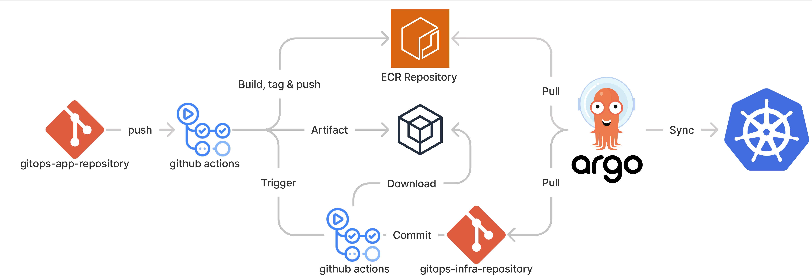

# GitOps Application Template

# Prerequisite
- Clone [GitOps Infrastructure Template](https://github.com/indentcorp/gitops-infra-template) and refer to the following `README.md` for customizing project.
- Or, click `Use this template` button on the top right to create a new repository from this template.
- Please be certain that it is a private repository. CD_ACCESS_KEY is only enabled when the repository is private.
- Install [`kubectl`](https://kubernetes.io/docs/tasks/tools/).
- Create ECR Repository for application.
- Set Secrets `INFRA_REPO`. 

# Workflow

# Customization
## `.github/workflows/ci.yml`
1. Register "Actions secrets" as below.
    - `ECR_REPOSITORY_NAME`: Amazon ECR Repository name.
    - `AWS_ACCESS_KEY_ID`: AWS IAM Access Key ID.
    - `AWS_SECRET_ACCESS_KEY`: AWS IAM Secret Access Key.
1. Edit the name of infrastructure repository. (Line 60)
1. Edit the name of kustomize image name. (Line 84)
1. If you want to utilize `prod` stage, duplicate from line 82~85.

## `src/`
1. Source of your application should be here.
2. If you want to locate to other directory, `.github/workflows/ci.yml` should be changed. (Line 41)
 
### Update k8s resources
To finish configuring the `infra` repository, you must modify every single file in the `./k8s` directory except `./base/kustomization.yml`.
Modify the placeholder in the angle bracket to a value appropriate for your project, just like any other file in the `./argo` directory.
NOTE: Do not apply the `./k8s` directory to the K8s cluster directly. That is exactly what ArgoCD will do for you.
